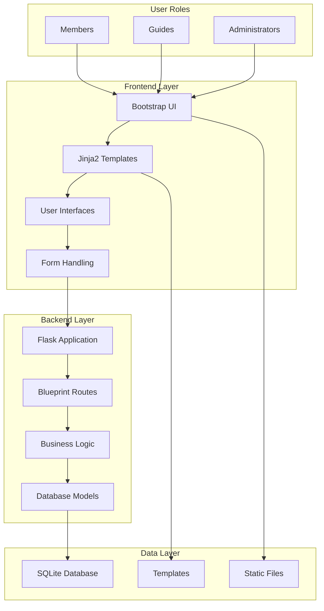

<div align="center"><a name="readme-top"></a>

<h1> <br/>East Coast Anglers Club Management System</h1>

# 🎣 East Coast Anglers Club<br/><h3>Comprehensive Fishing Club Management Platform</h3>

A modern web-based management system designed to streamline fishing club operations and enhance member experiences.<br/>
Features role-based dashboards, event management, guide booking, and community engagement tools.<br/>
One-click **FREE** deployment for fishing clubs and outdoor organizations.

[Live Demo][demo-link] · [Documentation][docs] · [Report Issues][github-issues-link]

<br/>

[][demo-link]

<br/>

<!-- SHIELD GROUP -->

[![][github-release-shield]][github-release-link]
[![][vercel-shield]][vercel-link]
[![][github-contributors-shield]][github-contributors-link]
[![][github-stars-shield]][github-stars-link]
[![][github-issues-shield]][github-issues-link]
[![][github-license-shield]][github-license-link]

**Share Project Repository**

[![][share-x-shield]][share-x-link]
[![][share-telegram-shield]][share-telegram-link]
[![][share-whatsapp-shield]][share-whatsapp-link]
[![][share-reddit-shield]][share-reddit-link]
[![][share-linkedin-shield]][share-linkedin-link]

<sup>🌟 Revolutionizing fishing club management for the digital age. Built for anglers, by anglers.</sup>


</div>

> [!TIP]
> This is a complete fishing club management solution with member dashboards, event booking, guide management, and administrative tools.

## 📸 Project Screenshots

> [!TIP]
> Experience the beautiful, responsive interface designed for fishing enthusiasts.

<div align="center">
  
  <p><em>Main Landing Page - Modern, Responsive Design</em></p>
</div>

<div align="center">
  
  
  <p><em>Dashboard Overview and Secure Login Interface</em></p>
</div>

<details>
<summary><kbd>📱 More Screenshots</kbd></summary>

<div align="center">
  <p><em>Additional screenshots of member dashboard, admin panel, and event management features will be displayed here</em></p>
</div>

</details>

## 🎬 Demo Video

> [!NOTE]
> Watch the fishing club management system in action with our comprehensive demo.

<div align="center">

https://github.com/user-attachments/assets/a0b4c026-536e-4546-a1dc-6e5ae982d4eb

*Comprehensive walkthrough of all major features*

</div>

**Tech Stack Badges:**

<div align="center">

 
 
 
 
 
 
 

</div>

> [!IMPORTANT]
> This project demonstrates modern web development practices specifically tailored for outdoor recreation management. It combines Flask backend with Bootstrap frontend to provide comprehensive club management functionality including member registration, event booking, guide scheduling, and administrative oversight.

<details>
<summary><kbd>📑 Table of Contents</kbd></summary>

#### TOC

- [🎣 East Coast Anglers ClubComprehensive Fishing Club Management Platform](#-east-coast-anglers-clubcomprehensive-fishing-club-management-platform)
  - [📸 Project Screenshots](#-project-screenshots)
  - [🎬 Demo Video](#-demo-video)
      - [TOC](#toc)
      - [](#)
  - [🌟 Introduction](#-introduction)
  - [✨ Key Features](#-key-features)
    - [`1` Member Management System](#1-member-management-system)
    - [`2` Event \& Guide Booking](#2-event--guide-booking)
    - [`*` Additional Features](#-additional-features)
  - [🛠️ Tech Stack](#️-tech-stack)
  - [🏗️ Architecture](#️-architecture)
    - [System Architecture](#system-architecture)
    - [Application Structure](#application-structure)
  - [🚀 Getting Started](#-getting-started)
    - [Prerequisites](#prerequisites)
    - [Quick Installation](#quick-installation)
    - [Development Mode](#development-mode)
  - [🛳 Deployment](#-deployment)
  - [📖 Usage Guide](#-usage-guide)
    - [Basic Usage](#basic-usage)
    - [Advanced Configuration](#advanced-configuration)
  - [🤝 Contributing](#-contributing)
    - [Development Process](#development-process)
    - [Contribution Guidelines](#contribution-guidelines)
  - [📄 License](#-license)
  - [👥 Team](#-team)
  - [🙋‍♀️ Author](#️-author)
  - [🚨 Troubleshooting](#-troubleshooting)
    - [Installation Issues](#installation-issues)
    - [Development Issues](#development-issues)
  - [📚 FAQ](#-faq)

####

<br/>

</details>

## 🌟 Introduction

Welcome to the East Coast Anglers Club Management System - a comprehensive web application designed to revolutionize how fishing clubs operate and engage with their members. Built with modern web technologies and a deep understanding of angling community needs.

Whether you're a club administrator managing events, a fishing guide coordinating sessions, or a member looking to participate in activities, this platform provides intuitive tools for every user type.

> [!NOTE]
> - Python 3.9+ required
> - Flask framework for robust backend functionality
> - Bootstrap 5 for responsive, mobile-friendly design
> - SQLite database for reliable data storage

| [![Live Demo][demo-shield-badge]][demo-link] | Experience the full functionality without any installation required! |
| :------------------------------------------- | :------------------------------------------------------------------- |

> [!TIP]
> **⭐ Star us** to stay updated with new features and improvements!

## ✨ Key Features

### `1` Member Management System

Experience comprehensive member lifecycle management with role-based access control. Our system supports three distinct user roles - Members, Guides, and Administrators - each with tailored dashboards and functionality.

**Key capabilities include:**
- 👥 **Multi-Role Support**: Members, Guides, and Administrators
- 📋 **Profile Management**: Complete member information tracking
- 🔐 **Secure Authentication**: Login/registration with session management
- 📊 **Activity Tracking**: Member participation and engagement metrics

### `2` Event & Guide Booking

Revolutionary booking system that streamlines event registration and guide scheduling. Members can easily browse and register for fishing trips, workshops, and one-on-one guide sessions.

**Available Features:**
- 📅 **Event Management**: Create and manage fishing events and workshops
- 🎣 **Guide Scheduling**: Book personalized sessions with expert guides
- 📝 **Registration System**: Simple, intuitive booking process
- 📰 **News & Updates**: Stay informed with club announcements

### `*` Additional Features

Beyond the core functionality, this system includes:

- [x] 🏠 **Modern Landing Page**: Attractive, informative homepage
- [x] 📱 **Responsive Design**: Mobile-friendly Bootstrap interface
- [x] 🔒 **Secure Access**: Role-based permissions and authentication
- [x] 📊 **Admin Dashboard**: Comprehensive administrative controls
- [x] 📝 **Content Management**: News, events, and member communication
- [x] 🎯 **User-Focused Design**: Intuitive navigation and user experience
- [x] 🌐 **Cross-Platform**: Works on desktop, tablet, and mobile devices

> ✨ Continuously evolving with new features based on community feedback.

<div align="right">

[![][back-to-top]](#readme-top)

</div>

## 🛠️ Tech Stack

<div align="center">
  <table>
    <tr>
      <td align="center" width="96">
        
        <br>Flask 2.0+
      </td>
      <td align="center" width="96">
        
        <br>Python 3.9+
      </td>
      <td align="center" width="96">
        
        <br>Bootstrap 5
      </td>
      <td align="center" width="96">
        
        <br>SQLite
      </td>
      <td align="center" width="96">
        
        <br>HTML5
      </td>
      <td align="center" width="96">
        
        <br>CSS3
      </td>
      <td align="center" width="96">
        
        <br>JavaScript
      </td>
    </tr>
  </table>
</div>

**Backend Stack:**
- **Framework**: Flask 2.0+ with Blueprint architecture
- **Language**: Python 3.9+ for robust server-side logic
- **Database**: SQLite for reliable data persistence
- **Templates**: Jinja2 templating engine
- **Forms**: Flask-WTF for secure form handling

**Frontend Stack:**
- **CSS Framework**: Bootstrap 5 for responsive design
- **Styling**: Custom CSS for fishing club theming
- **JavaScript**: Vanilla JS with Bootstrap components
- **Icons**: Custom SVG icons and Bootstrap icons
- **Responsive**: Mobile-first design approach

**Development Tools:**
- **Version Control**: Git for source code management
- **Package Management**: pip with requirements.txt
- **Deployment**: Compatible with various hosting platforms

> [!TIP]
> Each technology was selected for simplicity, reliability, and ease of deployment, making it perfect for fishing clubs of all sizes.

## 🏗️ Architecture

### System Architecture



### Application Structure

```
fishing-club-project/
├── app/                     # Main application package
│   ├── views/              # Route blueprints
│   │   ├── main.py        # Landing page routes
│   │   ├── auth.py        # Authentication routes
│   │   ├── member.py      # Member dashboard routes
│   │   ├── guide.py       # Guide management routes
│   │   └── admin.py       # Administrative routes
│   ├── templates/         # HTML templates
│   │   ├── main/          # Landing page templates
│   │   ├── auth/          # Login/register templates
│   │   ├── member/        # Member dashboard templates
│   │   ├── guide/         # Guide interface templates
│   │   └── admin/         # Admin panel templates
│   ├── static/           # Static assets
│   │   ├── css/          # Stylesheets
│   │   ├── js/           # JavaScript files
│   │   └── images/       # Images and media
│   ├── utilities/        # Helper functions
│   ├── models.py         # Database models
│   ├── forms.py          # Form definitions
│   └── config.py         # Configuration settings
├── app.py               # Application entry point
└── requirements.txt     # Python dependencies
```

## 🚀 Getting Started

### Prerequisites

> [!IMPORTANT]
> Ensure you have the following installed:

- Python 3.9+ ([Download](https://python.org/downloads/))
- pip package manager (included with Python)
- Git ([Download](https://git-scm.com/))

### Quick Installation

**1. Clone Repository**

```bash
git clone https://github.com/ChanMeng666/fishing-club-project.git
cd fishing-club-project
```

**2. Create Virtual Environment**

```bash
# Create virtual environment
python -m venv venv

# Activate virtual environment
# On Windows:
venv\Scripts\activate
# On macOS/Linux:
source venv/bin/activate
```

**3. Install Dependencies**

```bash
pip install -r requirements.txt
```

**4. Initialize Database**

```bash
# Run database initialization script
python init_db.py
```

**5. Start Development Server**

```bash
python app.py
```

🎉 **Success!** Open [http://localhost:5000](http://localhost:5000) to view the application.

### Development Mode

```bash
# Start with debug mode
python app.py

# The application will automatically reload on code changes
# Access different user roles:
# - Main page: http://localhost:5000
# - Login: http://localhost:5000/login
# - Register: http://localhost:5000/register
```

## 🛳 Deployment

> [!IMPORTANT]
> Choose the deployment strategy that best fits your fishing club's needs.

**Cloud Deployment Options:**

<div align="center">

|           Deploy with Heroku            |                     Deploy with PythonAnywhere                      |                     Deploy with Railway                      |
| :-------------------------------------: | :---------------------------------------------------------: | :---------------------------------------------------------: |
| [](https://heroku.com) | [](https://pythonanywhere.com) | [](https://railway.app) |

</div>

**Manual Deployment:**

```bash
# Install gunicorn for production
pip install gunicorn

# Run with gunicorn
gunicorn -w 4 -b 0.0.0.0:5000 app:app
```

**Environment Variables:**

```bash
# Production settings
export FLASK_ENV=production
export SECRET_KEY=your-secret-key-here
export DATABASE_URL=sqlite:///production.db
```

## 📖 Usage Guide

### Basic Usage

**Getting Started:**

1. **Visit Homepage** to explore club information and features
2. **Register Account** as a new member or guide
3. **Login** to access your personalized dashboard
4. **Explore Features** based on your role (Member/Guide/Admin)

**For Members:**
- Browse and register for fishing events
- Book one-on-one sessions with guides
- View club news and updates
- Manage personal profile and subscriptions

**For Guides:**
- Manage availability and schedules
- View upcoming sessions and events
- Update profile and specializations
- Access member booking requests

**For Administrators:**
- Manage all users, events, and content
- View comprehensive reports and analytics
- Configure system settings
- Oversee club operations

### Advanced Configuration

**Customizing the Club:**

```python
# app/config.py
class Config:
    CLUB_NAME = "East Coast Anglers Club"
    CLUB_DESCRIPTION = "Premier freshwater fishing community"
    MAX_MEMBERS = 500
    SUBSCRIPTION_FEES = {
        'basic': 50.00,
        'premium': 100.00,
        'lifetime': 500.00
    }
```

## 🤝 Contributing

We welcome contributions from the fishing and development communities! Here's how you can help:

### Development Process

**1. Fork & Clone:**

```bash
git clone https://github.com/ChanMeng666/fishing-club-project.git
cd fishing-club-project
```

**2. Create Feature Branch:**

```bash
git checkout -b feature/amazing-fishing-feature
```

**3. Make Changes:**

- Follow Python PEP 8 style guidelines
- Add appropriate comments and documentation
- Test your changes thoroughly
- Ensure responsive design principles

**4. Submit PR:**

- Provide clear description of changes
- Include screenshots for UI modifications
- Reference any related issues
- Ensure all tests pass

### Contribution Guidelines

**Code Style:**
- Use Python PEP 8 conventions
- Follow Flask best practices
- Write meaningful commit messages
- Add docstrings for new functions

**Areas for Contribution:**
- 🐛 **Bug Reports**: Help us identify and fix issues
- 💡 **Feature Requests**: Suggest new fishing club features
- 📚 **Documentation**: Improve our guides and documentation
- 🎨 **UI/UX**: Enhance the user experience
- 🔧 **Code**: Contribute new features or improvements

[](https://github.com/ChanMeng666/fishing-club-project/issues)

## 📄 License

This project is licensed under the MIT License - see the [LICENSE](LICENSE) file for details.

**Open Source Benefits:**
- ✅ Commercial use allowed
- ✅ Modification allowed
- ✅ Distribution allowed
- ✅ Private use allowed

## 👥 Team

<div align="center">
  <table>
    <tr>
      <td align="center">
        <a href="https://github.com/ChanMeng666">
          
          <br />
          <sub><b>Chan Meng</b></sub>
        </a>
        <br />
        <small>Creator & Lead Developer</small>
      </td>
    </tr>
  </table>
</div>

## 🙋‍♀️ Author

**Chan Meng**
-  LinkedIn: [chanmeng666](https://www.linkedin.com/in/chanmeng666/)
-  GitHub: [ChanMeng666](https://github.com/ChanMeng666)
-  Email: [chanmeng.dev@gmail.com](mailto:chanmeng.dev@gmail.com)
-  Website: [chanmeng.live](https://2d-portfolio-eta.vercel.app/)

## 🚨 Troubleshooting

<details>
<summary><kbd>🔧 Common Issues</kbd></summary>

### Installation Issues

**Python Version Conflicts:**
```bash
# Check Python version
python --version

# Use Python 3.9+
python3 -m venv venv
```

**Package Installation Failures:**
```bash
# Upgrade pip
python -m pip install --upgrade pip

# Install from requirements
pip install -r requirements.txt
```

### Development Issues

**Port Already in Use:**
```bash
# Check what's using port 5000
lsof -i :5000

# Kill the process or use different port
export FLASK_RUN_PORT=5001
```

**Database Issues:**
```bash
# Reset database
rm instance/database.db
python init_db.py
```

</details>

## 📚 FAQ

<details>
<summary><kbd>❓ Frequently Asked Questions</kbd></summary>

**Q: Can I customize this for my own fishing club?**
A: Absolutely! The system is designed to be easily customizable for any fishing organization.

**Q: Does it support multiple fishing clubs?**
A: Currently designed for single club use, but can be extended for multi-tenant support.

**Q: Can I add payment processing?**
A: Yes, the architecture supports integration with payment processors like Stripe or PayPal.

**Q: Is mobile access supported?**
A: Yes, the Bootstrap-based interface is fully responsive and mobile-friendly.

**Q: How do I backup my data?**
A: Regular SQLite database backups are recommended. See our deployment guide for details.

</details>

---

<div align="center">
<strong>🎣 Revolutionizing Fishing Club Management 🌟</strong>
<br/>
<em>Bringing fishing communities together through technology</em>
<br/><br/>

⭐ **Star us on GitHub** • 📖 **Read the Documentation** • 🐛 **Report Issues** • 💡 **Request Features** • 🤝 **Contribute**

<br/><br/>

**Made with ❤️ for the fishing community**


</div>

---

<!-- LINK DEFINITIONS -->

[back-to-top]: https://img.shields.io/badge/-BACK_TO_TOP-151515?style=flat-square

<!-- Project Links -->
[demo-link]: https://groupac.pythonanywhere.com/
[docs]: https://github.com/ChanMeng666/fishing-club-project#readme
[github-issues-link]: https://github.com/ChanMeng666/fishing-club-project/issues
[github-stars-link]: https://github.com/ChanMeng666/fishing-club-project/stargazers
[github-contributors-link]: https://github.com/ChanMeng666/fishing-club-project/contributors
[github-release-link]: https://github.com/ChanMeng666/fishing-club-project/releases
[github-license-link]: https://github.com/ChanMeng666/fishing-club-project/blob/main/LICENSE

<!-- Shield Badges -->
[github-release-shield]: https://img.shields.io/github/v/release/ChanMeng666/fishing-club-project?color=369eff&labelColor=black&logo=github&style=flat-square
[vercel-shield]: https://img.shields.io/badge/demo-online-55b467?labelColor=black&logo=vercel&style=flat-square
[github-contributors-shield]: https://img.shields.io/github/contributors/ChanMeng666/fishing-club-project?color=c4f042&labelColor=black&style=flat-square
[github-stars-shield]: https://img.shields.io/github/stars/ChanMeng666/fishing-club-project?color=ffcb47&labelColor=black&style=flat-square
[github-issues-shield]: https://img.shields.io/github/issues/ChanMeng666/fishing-club-project?color=ff80eb&labelColor=black&style=flat-square
[github-license-shield]: https://img.shields.io/badge/license-MIT-white?labelColor=black&style=flat-square

<!-- Badge Variants -->
[demo-shield-badge]: https://img.shields.io/badge/TRY%20DEMO-ONLINE-55b467?labelColor=black&logo=vercel&style=for-the-badge
[vercel-link]: https://groupac.pythonanywhere.com/

<!-- Social Share Links -->
[share-x-link]: https://x.com/intent/tweet?hashtags=opensource,fishing,flask&text=Check%20out%20this%20amazing%20fishing%20club%20management%20system&url=https%3A%2F%2Fgithub.com%2FChanMeng666%2Ffishing-club-project
[share-telegram-link]: https://t.me/share/url?text=Check%20out%20this%20fishing%20club%20project&url=https%3A%2F%2Fgithub.com%2FChanMeng666%2Ffishing-club-project
[share-whatsapp-link]: https://api.whatsapp.com/send?text=Check%20out%20this%20fishing%20club%20project%20https%3A%2F%2Fgithub.com%2FChanMeng666%2Ffishing-club-project
[share-reddit-link]: https://www.reddit.com/submit?title=Amazing%20Fishing%20Club%20Management%20System&url=https%3A%2F%2Fgithub.com%2FChanMeng666%2Ffishing-club-project
[share-linkedin-link]: https://linkedin.com/sharing/share-offsite/?url=https://github.com/ChanMeng666/fishing-club-project

[share-x-shield]: https://img.shields.io/badge/-share%20on%20x-black?labelColor=black&logo=x&logoColor=white&style=flat-square
[share-telegram-shield]: https://img.shields.io/badge/-share%20on%20telegram-black?labelColor=black&logo=telegram&logoColor=white&style=flat-square
[share-whatsapp-shield]: https://img.shields.io/badge/-share%20on%20whatsapp-black?labelColor=black&logo=whatsapp&logoColor=white&style=flat-square
[share-reddit-shield]: https://img.shields.io/badge/-share%20on%20reddit-black?labelColor=black&logo=reddit&logoColor=white&style=flat-square
[share-linkedin-shield]: https://img.shields.io/badge/-share%20on%20linkedin-black?labelColor=black&logo=linkedin&logoColor=white&style=flat-square
</rewritten_file>
