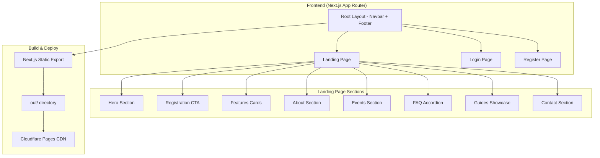

<div align="center"><a name="readme-top"></a>

<h1> <br/>East Coast Anglers Club</h1>

# 🎣 East Coast Anglers Club<br/><h3>Comprehensive Fishing Club Website</h3>

A modern, responsive fishing club website built with Next.js, Tailwind CSS, and shadcn/ui.<br/>
Features a polished landing page, video-background login, and guide showcase.<br/>
Deployed on **Cloudflare Pages** for global edge delivery.

[Live Demo][demo-link] · [Documentation][docs] · [Report Issues][github-issues-link]

<br/>

[][demo-link]

<br/>

<!-- SHIELD GROUP -->

[![][github-release-shield]][github-release-link]
[![][cloudflare-shield]][demo-link]
[![][github-contributors-shield]][github-contributors-link]
[![][github-stars-shield]][github-stars-link]
[![][github-issues-shield]][github-issues-link]
[![][github-license-shield]][github-license-link]

**Share Project Repository**

[![][share-x-shield]][share-x-link]
[![][share-telegram-shield]][share-telegram-link]
[![][share-whatsapp-shield]][share-whatsapp-link]
[![][share-reddit-shield]][share-reddit-link]
[![][share-linkedin-shield]][share-linkedin-link]

<sup>🌟 Revolutionizing fishing club management for the digital age. Built for anglers, by anglers.</sup>


</div>

> [!TIP]
> This is a modern fishing club website showcasing the club's services, guides, events, and membership information with a beautiful, responsive design.

## 📸 Project Screenshots

> [!TIP]
> Experience the beautiful, responsive interface designed for fishing enthusiasts.

<div align="center">
  
  <p><em>Main Landing Page - Modern, Responsive Design</em></p>
</div>

<div align="center">
  
  
  <p><em>Dashboard Overview and Secure Login Interface</em></p>
</div>

**Tech Stack Badges:**

<div align="center">

 
 
 
 
 
 

</div>

> [!IMPORTANT]
> This project uses a modern frontend stack (Next.js + Tailwind CSS + shadcn/ui) with static export deployed on Cloudflare Pages. It is a **frontend-only** project with no backend or database — all pages are statically generated.

<details>
<summary><kbd>📑 Table of Contents</kbd></summary>

#### TOC

- [🌟 Introduction](#-introduction)
- [✨ Key Features](#-key-features)
- [🛠️ Tech Stack](#️-tech-stack)
- [🏗️ Architecture](#️-architecture)
- [🚀 Getting Started](#-getting-started)
- [🛳 Deployment](#-deployment)
- [🤝 Contributing](#-contributing)
- [📄 License](#-license)
- [🙋‍♀️ Author](#️-author)

####

<br/>

</details>

## 🌟 Introduction

Welcome to the East Coast Anglers Club website — a modern, beautifully designed website for freshwater fishing enthusiasts. The site showcases the club's services, introduces fishing guides, displays upcoming events, and provides an intuitive registration flow.

The project was migrated from a legacy Flask + Bootstrap stack to a modern Next.js + Tailwind CSS + shadcn/ui architecture, deployed on Cloudflare Pages for fast global delivery.

> [!NOTE]
> - Node.js 18+ required
> - Next.js 16 with App Router and TypeScript
> - Tailwind CSS 4 + shadcn/ui for polished UI components
> - Static export deployed on Cloudflare Pages

| [![Live Demo][demo-shield-badge]][demo-link] | Experience the live site on Cloudflare Pages! |
| :------------------------------------------- | :-------------------------------------------- |

## ✨ Key Features

### `1` Landing Page

A comprehensive landing page with 8 distinct sections:

- 🏠 **Hero Section**: Welcome banner with club branding and call-to-action
- ✉️ **Registration CTA**: Email subscription bar for quick sign-up
- 🃏 **Feature Cards**: Membership Options, Event Booking, Guide Sessions
- ℹ️ **About Section**: Club introduction with imagery
- 📅 **Events Section**: Upcoming fishing trips and workshops
- ❓ **FAQ Accordion**: Interactive Q&A using shadcn/ui Accordion
- 🎣 **Guides Showcase**: 4 professional guide profiles with photos
- 📞 **Contact Section**: Phone, email, and address information

### `2` Authentication Pages

- 🎥 **Video Background Login**: Full-viewport `fishing.mp4` background with `darkkhaki` color overlay (`mix-blend-mode: overlay`), translucent form inputs
- 📝 **Registration Page**: Matching design with username, email, password, and confirm password fields
- 🔗 **Cross-linked**: Login and register pages link to each other

### `*` Design & UX

- [x] 📱 **Fully Responsive**: Mobile, tablet, and desktop layouts
- [x] 🎨 **Modern UI**: shadcn/ui components with Tailwind CSS
- [x] 🧭 **Mobile Navigation**: Sheet-based mobile menu
- [x] ⚡ **Static Export**: Pre-rendered HTML for instant page loads
- [x] 🌐 **Edge Delivery**: Cloudflare Pages CDN for global performance

<div align="right">

[![][back-to-top]](#readme-top)

</div>

## 🛠️ Tech Stack

<div align="center">
  <table>
    <tr>
      <td align="center" width="96">
        
        <br>Next.js 16
      </td>
      <td align="center" width="96">
        
        <br>TypeScript
      </td>
      <td align="center" width="96">
        
        <br>React 19
      </td>
      <td align="center" width="96">
        
        <br>Tailwind CSS 4
      </td>
      <td align="center" width="96">
        
        <br>shadcn/ui
      </td>
      <td align="center" width="96">
        
        <br>CF Pages
      </td>
    </tr>
  </table>
</div>

**Frontend Stack:**
- **Framework**: Next.js 16 (App Router, Turbopack)
- **Language**: TypeScript 5
- **UI Library**: React 19
- **Styling**: Tailwind CSS 4 + shadcn/ui (based on @base-ui/react)
- **Icons**: Lucide React + custom SVG icons
- **Fonts**: Geist Sans & Geist Mono (via `next/font/google`)

**Build & Deployment:**
- **Output**: Static export (`output: 'export'` in `next.config.ts`)
- **Hosting**: Cloudflare Pages (global CDN)
- **CLI**: Wrangler for deployment
- **Build Tool**: Turbopack (default in Next.js 16)

**Key Dependencies:**
- `@base-ui/react` — primitive components for shadcn/ui v4
- `class-variance-authority` — component variant management
- `tailwind-merge` — intelligent Tailwind class merging
- `lucide-react` — icon library
- `tw-animate-css` — animation utilities

> [!TIP]
> This is a frontend-only static site. No backend server, database, or API is required.

## 🏗️ Architecture

### System Architecture


```mermaid
graph TB
    subgraph "Frontend (Next.js App Router)"
        A[Root Layout - Navbar + Footer] --> B[Landing Page]
        A --> C[Login Page]
        A --> D[Register Page]
    end

    subgraph "Landing Page Sections"
        B --> B1[Hero Section]
        B --> B2[Registration CTA]
        B --> B3[Features Cards]
        B --> B4[About Section]
        B --> B5[Events Section]
        B --> B6[FAQ Accordion]
        B --> B7[Guides Showcase]
        B --> B8[Contact Section]
    end

    subgraph "Build & Deploy"
        E[Next.js Static Export] --> F[out/ directory]
        F --> G[Cloudflare Pages CDN]
    end

    A --> E
```

### Project Structure

```
fishing-club-project/
├── src/
│   ├── app/
│   │   ├── layout.tsx              # Root layout (Navbar + Footer)
│   │   ├── page.tsx                # Landing page (8 sections)
│   │   ├── globals.css             # Tailwind + shadcn/ui theme
│   │   ├── favicon.ico
│   │   ├── login/
│   │   │   └── page.tsx            # Video background login
│   │   └── register/
│   │       └── page.tsx            # Registration page
│   ├── components/
│   │   ├── ui/                     # shadcn/ui components
│   │   │   ├── accordion.tsx
│   │   │   ├── button.tsx
│   │   │   ├── card.tsx
│   │   │   ├── input.tsx
│   │   │   ├── navigation-menu.tsx
│   │   │   ├── separator.tsx
│   │   │   └── sheet.tsx
│   │   ├── layout/
│   │   │   ├── navbar.tsx          # Fixed top navbar with fish SVG logo
│   │   │   └── footer.tsx          # Copyright footer
│   │   └── landing/
│   │       ├── hero-section.tsx
│   │       ├── registration-cta.tsx
│   │       ├── features-cards.tsx
│   │       ├── about-section.tsx
│   │       ├── events-section.tsx
│   │       ├── faq-accordion.tsx
│   │       ├── guides-showcase.tsx
│   │       └── contact-section.tsx
│   └── lib/
│       └── utils.ts                # cn() class merge helper
├── public/
│   ├── fishing.mp4                 # Video background (2.1MB)
│   ├── shipfishing.svg             # Club logo SVG
│   └── favicon.ico
├── flask_app/                      # Legacy Flask app (archived)
├── app.py                          # Legacy Flask entry point (archived)
├── next.config.ts                  # Next.js config (static export)
├── tailwind.config.ts              # Tailwind CSS config
├── tsconfig.json                   # TypeScript config
├── components.json                 # shadcn/ui config
├── postcss.config.mjs              # PostCSS config
├── eslint.config.mjs               # ESLint config
├── package.json                    # Node.js dependencies
├── CODE_OF_CONDUCT.md
├── LICENSE                         # MIT License
└── README.md
```

### Pages & Routes

| Route | File | Description |
|-------|------|-------------|
| `/` | `src/app/page.tsx` | Landing page with 8 sections |
| `/login` | `src/app/login/page.tsx` | Video background login (display only) |
| `/register` | `src/app/register/page.tsx` | Registration form (display only) |

### External Resources

The landing page references external images via CDN:
- `cdn.pixabay.com` — Fly fishing hero image, fishing trip image, guide profile photos
- `th.bing.com` — About section lake image

## 🚀 Getting Started

### Prerequisites

> [!IMPORTANT]
> Ensure you have the following installed:

- Node.js 18+ ([Download](https://nodejs.org/))
- npm 9+ (included with Node.js)
- Git ([Download](https://git-scm.com/))

### Quick Installation

**1. Clone Repository**

```bash
git clone https://github.com/ChanMeng666/fishing-club-project.git
cd fishing-club-project
```

**2. Install Dependencies**

```bash
npm install
```

**3. Start Development Server**

```bash
npm run dev
```

🎉 **Success!** Open [http://localhost:3000](http://localhost:3000) to view the application.

### Available Scripts

```bash
npm run dev      # Start development server (Turbopack)
npm run build    # Build static export to out/ directory
npm run start    # Start production server (not used for static)
npm run lint     # Run ESLint
```

## 🛳 Deployment

> [!IMPORTANT]
> The project is deployed on **Cloudflare Pages** as a static site.

### Cloudflare Pages Deployment

**Prerequisites:**
- Cloudflare account
- Wrangler CLI (`npm install -D wrangler`)

**Deploy Commands:**

```bash
# 1. Login to Cloudflare
npx wrangler login

# 2. Build the static site
npm run build

# 3. Deploy to Cloudflare Pages
# Replace ACCOUNT_ID with your Cloudflare account ID
CLOUDFLARE_ACCOUNT_ID=your-account-id npx wrangler pages deploy out --project-name=fishing-club --commit-dirty=true
```

**Current Deployment:**
- **Production URL**: https://fishing-club.pages.dev
- **Account**: chanmeng.dev@gmail.com
- **Account ID**: `c87dca24333f7ed5d643f731f6308fec`
- **Project Name**: `fishing-club`

### Alternative: GitHub Integration

You can also connect the repository directly to Cloudflare Pages for automatic deployments:

1. Go to Cloudflare Dashboard → Pages
2. Connect to GitHub repository
3. Set build command: `npm run build`
4. Set build output directory: `out`

## 🤝 Contributing

We welcome contributions from the fishing and development communities!

### Development Process

**1. Fork & Clone:**

```bash
git clone https://github.com/ChanMeng666/fishing-club-project.git
cd fishing-club-project
```

**2. Create Feature Branch:**

```bash
git checkout -b feature/amazing-feature
```

**3. Make Changes:**

- Follow TypeScript best practices
- Use Tailwind CSS for styling (no inline styles)
- Create modular React components
- Ensure responsive design
- Test on multiple viewport sizes

**4. Submit PR:**

- Provide clear description of changes
- Include screenshots for UI modifications
- Ensure `npm run build` succeeds

### Code Style

- TypeScript strict mode enabled
- React functional components with hooks
- Tailwind CSS utility-first approach
- shadcn/ui for reusable UI components
- Lucide React for icons

[](https://github.com/ChanMeng666/fishing-club-project/issues)

## 📄 License

This project is licensed under the MIT License - see the [LICENSE](LICENSE) file for details.

**Open Source Benefits:**
- ✅ Commercial use allowed
- ✅ Modification allowed
- ✅ Distribution allowed
- ✅ Private use allowed

## 🙋‍♀️ Author

**Chan Meng**
-  LinkedIn: [chanmeng666](https://www.linkedin.com/in/chanmeng666/)
-  GitHub: [ChanMeng666](https://github.com/ChanMeng666)
-  Email: [chanmeng.dev@gmail.com](mailto:chanmeng.dev@gmail.com)
-  Website: [chanmeng.org](https://chanmeng.org/)

---

<div align="center">
<strong>🎣 Revolutionizing Fishing Club Management 🌟</strong>
<br/>
<em>Bringing fishing communities together through technology</em>
<br/><br/>

⭐ **Star us on GitHub** • 📖 **Read the Documentation** • 🐛 **Report Issues** • 💡 **Request Features** • 🤝 **Contribute**

<br/><br/>

**Made with ❤️ for the fishing community**


</div>

---

<!-- LINK DEFINITIONS -->

[back-to-top]: https://img.shields.io/badge/-BACK_TO_TOP-151515?style=flat-square

<!-- Project Links -->
[demo-link]: https://fishing-club.pages.dev
[docs]: https://github.com/ChanMeng666/fishing-club-project#readme
[github-issues-link]: https://github.com/ChanMeng666/fishing-club-project/issues
[github-stars-link]: https://github.com/ChanMeng666/fishing-club-project/stargazers
[github-contributors-link]: https://github.com/ChanMeng666/fishing-club-project/contributors
[github-release-link]: https://github.com/ChanMeng666/fishing-club-project/releases
[github-license-link]: https://github.com/ChanMeng666/fishing-club-project/blob/main/LICENSE

<!-- Shield Badges -->
[github-release-shield]: https://img.shields.io/github/v/release/ChanMeng666/fishing-club-project?color=369eff&labelColor=black&logo=github&style=flat-square
[cloudflare-shield]: https://img.shields.io/badge/demo-online-F38020?labelColor=black&logo=cloudflare&style=flat-square
[github-contributors-shield]: https://img.shields.io/github/contributors/ChanMeng666/fishing-club-project?color=c4f042&labelColor=black&style=flat-square
[github-stars-shield]: https://img.shields.io/github/stars/ChanMeng666/fishing-club-project?color=ffcb47&labelColor=black&style=flat-square
[github-issues-shield]: https://img.shields.io/github/issues/ChanMeng666/fishing-club-project?color=ff80eb&labelColor=black&style=flat-square
[github-license-shield]: https://img.shields.io/badge/license-MIT-white?labelColor=black&style=flat-square

<!-- Badge Variants -->
[demo-shield-badge]: https://img.shields.io/badge/TRY%20DEMO-ONLINE-F38020?labelColor=black&logo=cloudflare&style=for-the-badge

<!-- Social Share Links -->
[share-x-link]: https://x.com/intent/tweet?hashtags=opensource,fishing,nextjs&text=Check%20out%20this%20amazing%20fishing%20club%20website&url=https%3A%2F%2Fgithub.com%2FChanMeng666%2Ffishing-club-project
[share-telegram-link]: https://t.me/share/url?text=Check%20out%20this%20fishing%20club%20project&url=https%3A%2F%2Fgithub.com%2FChanMeng666%2Ffishing-club-project
[share-whatsapp-link]: https://api.whatsapp.com/send?text=Check%20out%20this%20fishing%20club%20project%20https%3A%2F%2Fgithub.com%2FChanMeng666%2Ffishing-club-project
[share-reddit-link]: https://www.reddit.com/submit?title=Amazing%20Fishing%20Club%20Website&url=https%3A%2F%2Fgithub.com%2FChanMeng666%2Ffishing-club-project
[share-linkedin-link]: https://linkedin.com/sharing/share-offsite/?url=https://github.com/ChanMeng666/fishing-club-project

[share-x-shield]: https://img.shields.io/badge/-share%20on%20x-black?labelColor=black&logo=x&logoColor=white&style=flat-square
[share-telegram-shield]: https://img.shields.io/badge/-share%20on%20telegram-black?labelColor=black&logo=telegram&logoColor=white&style=flat-square
[share-whatsapp-shield]: https://img.shields.io/badge/-share%20on%20whatsapp-black?labelColor=black&logo=whatsapp&logoColor=white&style=flat-square
[share-reddit-shield]: https://img.shields.io/badge/-share%20on%20reddit-black?labelColor=black&logo=reddit&logoColor=white&style=flat-square
[share-linkedin-shield]: https://img.shields.io/badge/-share%20on%20linkedin-black?labelColor=black&logo=linkedin&logoColor=white&style=flat-square

---

<!-- CHAN MENG PERSONAL BRAND -->
<div align="center">
  <a href="https://github.com/ChanMeng666" target="_blank">
    
  </a>

  <p><strong>Chan Meng</strong><br/>Need a custom app like this one? I build them — let's talk.</p>

  <a href="mailto:chanmeng.dev@gmail.com"></a>
  <a href="https://github.com/ChanMeng666"></a>
</div>
<!-- /CHAN MENG PERSONAL BRAND -->
